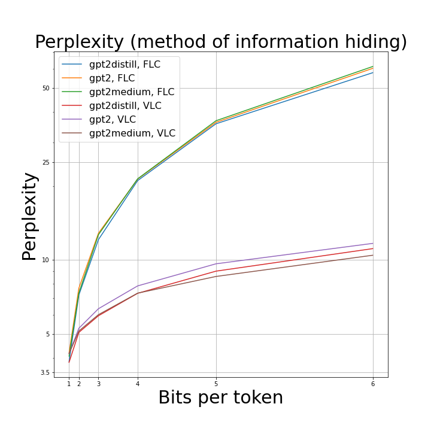

# mds20_stega
This is the repository for the Models of Sequence Data 2020 Edition for the project [RNN-Stega: Linguistic Steganography Based on Recurrent Neural Networks](http://static.tongtianta.site/paper_pdf/899f6470-c222-11e9-9474-00163e08bb86.pdf)

---
## Installation & Setup 

```console
git clone https://github.com/rodrigorivera/mds20_stega.git
python3 -m venv rnnstega
source rnnstega/bin/activate
pip install -r requirements.txt
```

---
## Structure of repository:

```bat
.
├── data
│   ├── wikitext-2
│   ├── generated_texts
|   ├── gpt2medium_generated
|   ├── bitstream.txt
│   └── some other files
|
├── rnn_attacker
│   ├── data
|   |   ├── ...
│   ├── generate_attacker_data_pipeline.ipynb
│   ├── steganografic_detector_pipeline.ipynb
│   └── models(checkpoints)
|       ├──....

├── src
│   ├── utils
|   |   ├──data.py
|   |   ├──encoding.py
|   |   ├──transformer_generate.py
|   |   └──utils.py
|   |
│   ├── discriminator
|   |   ├──utils_discriminator.py
|   |   └──discriminator.py
│   ├── lstm
|   |   ├──model.py
|   |   ├──generate.py
|   |   ├──train.py
|   |   └──steganography.py
|   |
│   ├── generate_without_steganography.py
│   └── perplexity_exp.py
|
|
├── scripts
|   └── perplexity_script.sh(bash script for generating text)
|
└── repos
    ├── RNN-Stega
    ├── word_language_model	
    └── steganography-lstm-master
```

---
## Usage

### Scripts for Transformers:

Generate pure text via pretrained transformer(without steganography)
```console
!python src/generate_without_steganography.py \
--model_path {PATH to HUGGINGFACE Model or your pretrained one} \
--data_path data/wikitext-2 \
--out_path experiment/generated.json \
--seed 42 \
--cuda \
--utterances_to_generate 100 \
--sentences_per_unique_start 5 \
--do_sample \
--top_k 0 \
--top_p 0.8 \
--max_length 50 \
--min_length 15
```

Script which generates texts via GPT2, encoding private message inside, using Fixed Length Coding and Variable Length Coding. Experiments use a range of bits per token.

```bash
bash scipts/perplexity_script.sh folder_to_save_exp number_of_generated_utt_per_each_experiment
```

Replication of table 3 from paper: dependence of perplexity on different models.



| beats per token | FLC(perplexity)    | VLC(perplexity)    | beats per token(VLC) |
|---|--------------------|--------------------|----------------------|
| 1 | 3.86 | 3.83 | 1.01   |
| 2 | 7.20  | 5.07 | 1.81  |
| 3 | 12.10 | 5.93  | 2.41    |
| 4 | 21.02 | 7.32  | 3.04    |
| 5 | 35.79  | 9.00  | 3.62     |
| 6 | 57.72  | 11.12 | 4.18    |


Discriminator script, which uses pretrained Transformer(e.g roberta-base) to find out if utterance was generated, depending on private code or not. Script iterates through folder of generated jsons. Each experiment is holded several times for for statistics collection. In our experiments we splited data in 70/30 proportion(). Script outputs accuracy and ROC-AUC on test-set.

```console
!python src/ddiscriminator/discriminator.py \
--transformers_path roberta-base \
--device cuda \
--n_splits 3 \
--test_size 0.3 \
--data_folder experiment/texts/ \
--non_modified_data experiment/generated.json \
--result_path experiment/discriminator_stat.json \
--checkpoint_path trained.pt \
--n_epoch 3 \
--seed 42
```
| Generation by GPT2-medium Discriminator: Roberta |    FLC acc    |  FLC roc_auc  | FLC f1-score min |    VLC acc    |  VLC roc_auc  | VLC f1-score min |
|:------------------------------------------------:|:-------------:|:-------------:|:----------------:|:-------------:|:-------------:|:----------------:|
|                         1                        | 0.999 ± 0.001 |   1.0 ± 0.0   |   0.999 ± 0.002  |   1.0 ± 0.0   |   1.0 ± 0.0   |     1.0 ± 0.0    |
|                         2                        |   0.75 ± 0.0  |  0.591 ± 0.06 |     0.0 ± 0.0    | 0.919 ± 0.009 | 0.933 ± 0.013 |   0.813 ± 0.024  |
|                         3                        | 0.988 ± 0.001 | 0.999 ± 0.001 |   0.977 ± 0.003  | 0.905 ± 0.033 | 0.927 ± 0.021 |   0.825 ± 0.046  |
|                         4                        | 0.994 ± 0.002 | 0.999 ± 0.001 |   0.989 ± 0.004  | 0.964 ± 0.008 | 0.989 ± 0.004 |   0.933 ± 0.014  |
|                         5                        | 0.997 ± 0.003 |   1.0 ± 0.0   |   0.995 ± 0.006  |  0.98 ± 0.003 | 0.988 ± 0.006 |   0.961 ± 0.005  |
|                         6                        | 0.999 ± 0.001 |   1.0 ± 0.0   |   0.999 ± 0.002  | 0.993 ± 0.001 | 0.999 ± 0.002 |   0.987 ± 0.003  |

---
RNN-based steganografic detector and it's results of the proportions of steganographic text generated that are correctly detected are presented here. The detector is bidirectional LSTM, with 2 layers and 0.5 dropout layer between them. The detectors trained with train-test-split 70/30, batch size is 64. For each type of an encoding scheme and each number of bits, the detector was trained from scratch, and then the final metrics Accuracy and ROC_AUC were obtained. 

| dataset| num of bits   | FLC_acc(%) | FLC_roc_auc | VLC_acc(%) | VLC_roc_auc |
| ---|----|---------|-------------|---------|-------------|
|**Imdb** |  1 | 96.72   | 0.968       | 93.02   | 0.987       |
| |  2 | 89.06   | 0.992     | 87.97   | 0.982     |
| |  3 | 83.49   | 0.877     | 81.51  |  0.933     |
| | 4 |     86.56 | 0.888     | 85.73  | 0.950     |
| | 5 | 87.97  | 0.803     |   88.91 | 0.899     |
| | 6 | 96.09  | 0.96      | 82.97 | 0.802     |
|||||||
|**News** |  1 | 100   | 1.0       | 100   | 1.0       |
| |  2 | 99.38 | 1.0    | 99.84 | 1.0     |
| |  3 | 100   | 1.0    | 99.84 | 1.0     |
| | 4 | 100   | 1.0    | 100   | 1.0     |
| | 5 | 99.28  | 1.0     |   99.50 | 1.0     |
| | 6 | 98.93  | 1.0      | 99.64   | 1.0     |
|||||||
|**Twitter** |  1 | 87.19 | 0.990       | 71.09 | 0.968       |
| |  2 | 57.03 | 0.991    | 55.94 | 0.996     |
| |  3 | 88.02 | 0.979    | 93.39 | 0.989     |
| | 4 | 86.41 | 0.948    | 93.91 | 0.983     |
| | 5 | 78.23 | 0.887     |   92.08 | 0.968     |
| | 6 | 58.13 | 0.915      | 88.85 | 0.960     |


Run tests for transformer text generation. Hide random information into generated text\\
with different bits per word
```console
!python src/utils/transformer_generate.py
```

---
---
### Scripts for LSTM(failed experiments so far...):

Train model on data corpus:
```console
!python src/lstm/train.py \
--data data/wikitext-2/ \
--model LSTM \
--emsize 800 \
--nhid 800 \
--nlayers 3 \
--epochs 35 \
--batch_size 200 \
--bptt 50 \
--dropout 0.2 \
--seed 42 \
--log-interval 100 \
--cuda
```

Script for basic steganography algorithm, described in the paper. However, maybe, it consists some bugs(or the quality of our language model is extremely low). The information hiding algorithm is based on variable-length coding(VLC), based on a Huffman tree.
```console
!python src/lstm/steganography.py \
--data data/wikitext-2/ \
--model LSTM \
--emsize 800 \
--nhid 800 \
--nlayers 3 \
--checkpoint lstm_wikitext2.pt \
--seed 42 \
--cuda \
--len_of_generation 40 \
--bit_num 2 \
--utterances_to_generate 100 \
--bit_stream_path data/experiment/bit_stream.txt \
--save_path data/experiment/
```

Generate text, using a pretrained model. The script itself does not solve the problems associated with steganography but can be used to evaluate the language model.
```console
!python src/lstm/generate.py \
--data ./data/wikitext-2 \
--model LSTM \
--emsize 800 \
--nhid 800 \
--nlayers 3 \
--dropout 0.2 \
--checkpoint lstm_wikitext2.pt \
--outf generated_sample.txt \
--words 5000 \
--seed 42 \
--cuda
```

[Link to LSTM checkpoint](https://drive.google.com/file/d/1KALhEWSYobpav_eDgn58Otjob09fpy4m/view?usp=sharing) on Wikitext-2: $800$-dimensional vectors, 3 LSTM hidden layers , 800 LSTM units, 20 epochs, Adam optimizer, lr = 1e{-4}, linear scheduling.

---
Existing repositories, repositories with similar approaches.

| Path  | Description
| :---  | :----------
| repos | existing implementation
| &boxvr;&nbsp; [RNN-Stega](https://github.com/YangzlTHU/RNN-Stega) | Tensorflow implementation of RNN-Stega.
| &boxvr;&nbsp; [word_language_model](https://github.com/pytorch/examples/tree/master/word_language_model) | Torch code for training language model and text generating.
| &boxvr;&nbsp; [steganography-lstm-master](https://github.com/tbfang/steganography-lstm) | Torch code for another steganographic paper "Generating Steganographic Text with LSTMs" which uses another information-encoding algorithm for encrypted messages exchanging

---

|                              Tasks to do                              | Status |
|:---------------------------------------------------------------------:|:------:|
|                         FLC encoding algorithm                        |    ✅   |
|                            Code refactoring                           |    🌝   |
|          Add attacks and their metrics(table 5 in the paper)          |    ✅   |
|   Natural Language Generation metrics(perplexity, maybe some other)   |    ✅   |
|                    New encoding scheme from Notion                    |    🤨   |
| Improve Language model: train LSTM on a larger text corpus/ take GPT? |    ✅   |
